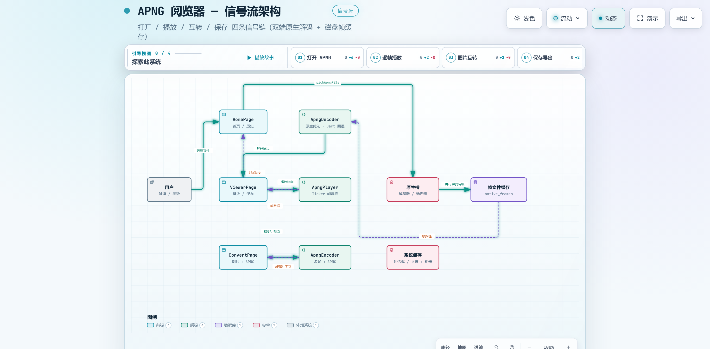
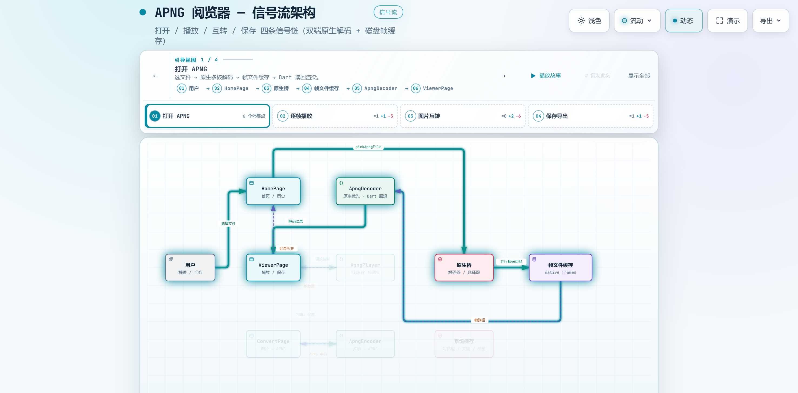
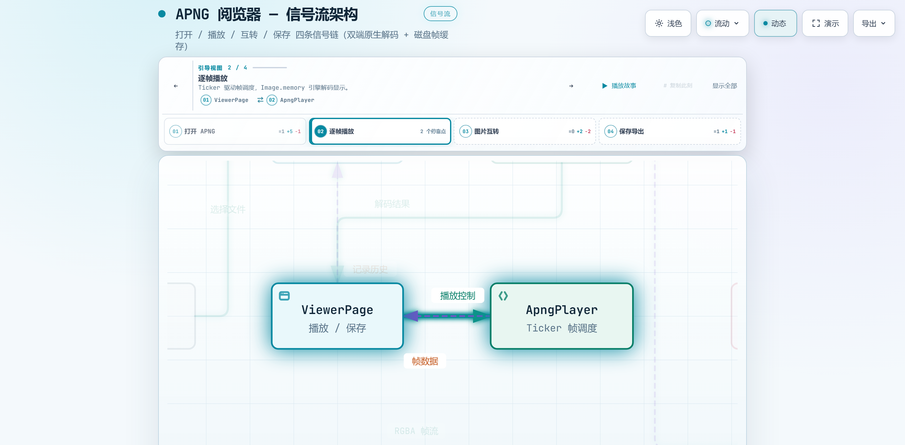
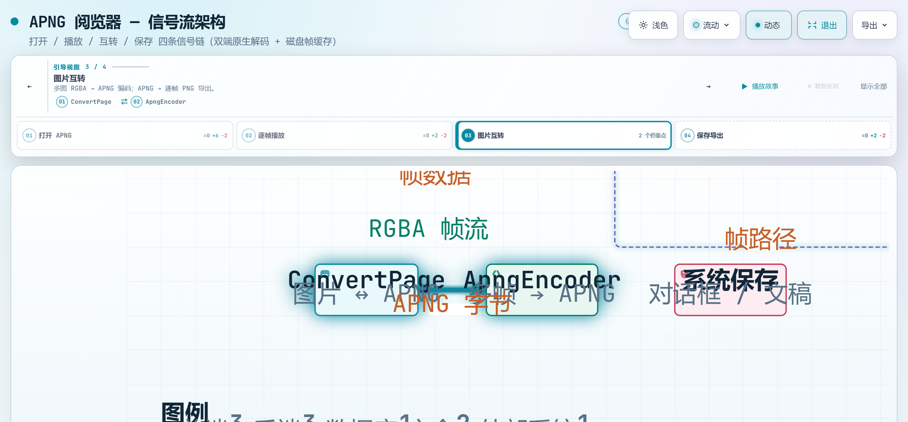
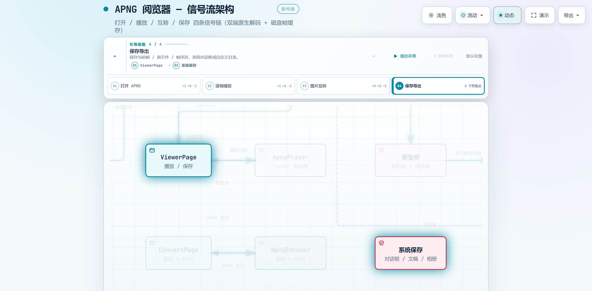

# APNG Viewer — English Overview

A cross-platform **Flutter** application for viewing and processing **Animated PNG (APNG)** images, targeting **Android 16 (API 36)** and **iPadOS 15.1+** (Apple Silicon native). The application delivers native-decoding performance on both platforms through a hybrid architecture: platform-specific native decoders run multi-core parallel frame extraction, while the Dart layer orchestrates rendering, playback, and persistence.

## Architecture

```
User
 └─ Flutter Presentation Layer (HomePage / ViewerPage / ConvertPage)
     └─ Dart Logic Layer (ApngDecoder / ApngPlayer / ApngEncoder)
         └─ Native Bridge (MainActivity.kt · AppDelegate.swift)
             └─ Frame Cache (native_frames) / System Save
```

### Decoding Pipeline (Native-First)

| Platform | Decoder | Parallelism | Output |
|---|---|---|---|
| Android | `ApngNativeDecoder.kt` (zlib + row unfiltering) | `Executors.newFixedThreadPool(cpuCount)` | PNG frames → `native_frames/` |
| iOS | `ApngNativeDecoder.swift` (ImageIO `CGImageSource`) | `DispatchQueue.concurrentPerform` | PNG frames → `native_frames/` |

- **Cache key** = file size + mtime; a cache hit loads the decoded frame set with zero re-decoding (instant re-open).
- **Fallback** = pure Dart `image` package decoder with isolate-parallel PNG encoding when the native path is unavailable.

### Playback

`ApngPlayer` drives a Ticker-based frame scheduler with speed control (0.25×–4×), frame-accurate seeking, play/pause, and progress callbacks. Frames render through `Image.memory` (engine-decoded PNG), eliminating cross-layer byte-order issues.

### Conversion

- **Image → APNG**: multi-select sources (PNG/JPEG/WebP/GIF/BMP), configurable frame delay and loop count; `ApngEncoder` normalizes per-frame dimensions via `copyResize` before encoding.
- **APNG → Image**: frame extraction to individual PNGs with bulk export to a user-selected directory or per-file system save dialogs.

### Save Modes & Guardrails

Three global save modes (toggle from the home screen):

| Mode | Behavior |
|---|---|
| System dialog | Native save sheet (cancel/gesture-dismiss both reset the button immediately via delegate callbacks) |
| Default folder | iOS: `APNG_Exporter/` in Files app; Android: `Pictures/APNG_Exporter` via MediaStore (no SAF grant needed) |
| Photo album | iOS PhotoKit `PHPhotoLibrary` / Android MediaStore |

Cancelling the system dialog — via the Cancel button **or** swipe-down dismissal — triggers a native callback (`documentPickerWasCancelled` / `presentationControllerDidDismiss`) that resets the UI instantly and shows "File save cancelled". No timeouts are needed; every export path uses `try/finally` so the button always recovers.

## Feature Highlights

- APNG animation playback with frame-exact controls
- Interactive zoom on large static PNGs (`InteractiveViewer`)
- Bidirectional image ↔ APNG conversion
- Configurable export destination (system dialog vs. bulk directory)
- Source-path reading without local image caching
- Playback speed control (0.25×–4×)
- Light/dark theme toggle (persisted)
- Recent-files history (last 10)
- External open support (`ACTION_VIEW` / `ACTION_SEND`)

## Architecture Diagram



### Four Signal Chains

| Chain | Diagram | Description |
|---|---|---|
| Open APNG |  | Pick file → native multi-core decode → frame cache → Dart render |
| Play |  | Ticker frame scheduling, Image.memory engine decode |
| Convert |  | Multi-image RGBA → APNG encode; APNG → per-frame PNG export |
| Save |  | Save current frame / original / frames to dialog, folder, or album |

[Open the interactive signal-flow diagram](architecture.html?theme=light&present=1#view=open-flow) — hover/click components to focus, switch between the four chains above, toggle light/dark themes, and trace routes.

## Build

```bash
flutter pub get
flutter analyze
flutter test
flutter build apk --release --target-platform android-arm64
```

## Repository

GitHub: [TsangAsuna/APNG-View-for-Android](https://github.com/TsangAsuna/APNG-View-for-Android)
